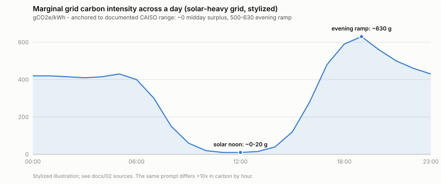

# The Duck Curve, or: When You Prompt Matters More Than You Think

*Part 2 of the [footprint](../README.md) deep-dive series.*

The same prompt, on the same model, in the same datacenter, can carry a **>10× different carbon footprint depending on the hour you send it**. That single fact is the reason this project exists as more than a calculator — and it comes from the shape of the modern grid.

## What the duck curve is

In 2013, California's grid operator (CAISO) published a chart of *net load* — total demand minus solar and wind — across a day. Midday solar carves a deep belly into the curve; when the sun sets, demand is still high, and the grid must ramp conventional generation ferociously to compensate. The silhouette looks like a duck: belly at noon, neck rising into the evening.

A decade later the duck has grown up:

- California's midday **net demand fell 45% between 2020 and 2024** (9am–3pm average); the belly-to-2018 gap now exceeds **13.6 GW**.
- The evening ramp requires up to **17,000 MW of generation to come online in ~3 hours** — the equivalent of switching on a mid-sized country at dinnertime.
- Solar is now so abundant midday that CAISO **curtailed (threw away) more than 738,000 MWh in the first four months of 2025 alone**, and **~13% of all hours in 2024 cleared at negative prices** (up from ~6% in 2023). At those moments the grid will literally pay you to consume electricity.

## From duck curve to carbon curve

Net load shape translates directly into **marginal carbon intensity** — the emissions of the generator that responds to one more unit of demand (your prompt):

- **Midday**: the marginal resource on a solar-heavy grid is often surplus solar that would otherwise be curtailed. Marginal emissions approach **zero**.
- **Evening ramp**: the marginal resource is dispatchable thermal — gas peakers, imports. California's marginal emission rate hits **0.5–0.63 tCO₂/MWh (500–630 gCO₂/kWh)** during evening peaks.

That's the >10× swing. For comparison, this project's static default — Google's fleet-wide location-based average of **345 gCO₂e/kWh** — sits right between the midday floor and the evening peak. It's a fair *average*; it's just blind to the fact that you get to choose which side of it you're on.

Two accounting notes to keep this honest (METHODOLOGY.md §1.4):

- **Marginal vs. average**: your *decision to prompt now vs. later* is a marginal question, and marginal CI is the right signal for it. Averages are the right basis for attributing a total. The tool reports averages and uses marginal/forecast signals only for timing advice.
- **Location-based vs. market-based**: providers buy clean-energy certificates that can cut their *market-based* number 3–4× below the physical grid's (Google 2024: 345 location-based vs 94 market-based). This tool defaults to location-based — the electrons, not the contracts.

## Does anyone actually schedule compute this way? Yes.

This isn't a hypothetical optimization:

- **Google's carbon-intelligent computing platform** shifts flexible workloads (batch jobs, video processing) toward low-carbon hours using Electricity Maps hourly forecasts — in production since 2020.
- **"Camel profiles"** — shaping datacenter load to follow solar output (two humps around the solar day) — cut marginal emissions **25–40%** versus flat load for a modeled 1,000 MW facility.
- Cross-site inference routing at renewable farms and carbon-aware scheduling are now an active systems-research field (CarbonEdge, XWind, ACM GSCC 2025 line of work).
- **Batch APIs** are the user-facing version: OpenAI and Anthropic both sell 50% discounts for 24-hour-window batch processing — giving the provider exactly the temporal flexibility the duck curve rewards.

The economics point the same direction as the carbon: midday surplus power is *cheap* (sometimes negative), evening ramp power is expensive. Datacenter electricity costs vary ~3× across US states and 4–5× globally, and energy-aware routing platforms (e.g. CLōD, running 500+ MW across four power markets) already arbitrage this in production. One caution this project enforces (METHODOLOGY.md §3.5): **cheap electricity correlates with clean electricity only loosely** — price is never used as a carbon proxy here. Hydro-heavy grids are cheap and clean; coal-heavy grids can be cheap and dirty.

## What `footprint` does with this

1. With a free Electricity Maps token and `FOOTPRINT_SITE` configured, the tool fetches **live grid carbon intensity hourly** and prices your session's carbon at the real current number instead of the static 345 — labeled `(live-grid …)` so you always know the basis.
2. With a forecast available, `/footprint` compares *now* against the **cleanest hour of the next 24** and tells you the ratio: "Grid now: 480 g. Cleanest hour: ~90 g at 13:00 — deferring heavy sessions cuts carbon ~5×."
3. Without any live signal, it falls back to static averages and *says so* — the speculative time-of-day shapes in `coefficients.json` are labeled speculative and never silently applied.

## Practical guidance

- **Interactive work**: prompt when you need to. A chat message's absolute footprint is tiny (doc 01); don't schedule your creativity around the grid.
- **Deferrable heavy work** — big batch evals, dataset generation, overnight agent runs: this is where the duck curve is your lever. Midday on a solar-heavy grid, or the batch API, can cut the carbon of identical work 2–10×.
- **The evening peak (17:00–21:00 local, solar-heavy grids) is the worst time** for heavy discretionary compute — highest marginal CI *and* (doc 03) the hours when strained grids leaning on datacenter demand-response are most likely to have diesel in the mix.

## Sources

- CAISO, "What the duck curve tells us about managing a green grid" — [caiso.com](https://www.caiso.com/documents/flexibleresourceshelprenewables_fastfacts.pdf)
- GridStatus, [CAISO solar & storage, spring 2025](https://blog.gridstatus.io/caiso-solar-storage-spring-2025/) (curtailment, ramp, battery figures)
- FactSet, [From Duck to Canyon](https://insight.factset.com/from-duck-to-canyon-how-caisos-load-profile-has-evolved) (net-demand evolution)
- REsurety / Ascend Analytics on [CAISO negative prices](https://resurety.com/article-negative-prices-in-caiso/)
- California grid marginal-emissions analysis (0.5–0.63 tCO₂/MWh evening peak; camel profiles 25–40%): see CLOUD_CONTEXT.md source set
- Google carbon-intelligent computing (production temporal load shifting), [ACM GSCC carbon-aware inference](https://dl.acm.org/doi/10.1145/3797248.3815402), [CarbonEdge](https://arxiv.org/abs/2502.14076)
- Google 2024 location vs market-based CI: [arXiv:2508.15734](https://arxiv.org/abs/2508.15734)
