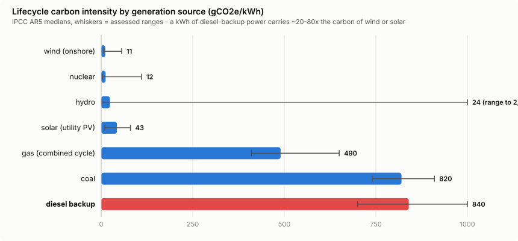

# Fuel Mix and the Diesel in the Basement

*Part 3 of the [footprint](../README.md) deep-dive series.*

A kilowatt-hour is not a kilowatt-hour. Depending on what generates it, the same unit of electricity powering the same inference carries anywhere from **~11 to ~1,000 grams of CO₂e** — a two-orders-of-magnitude spread that dwarfs every model-efficiency difference in this project. This doc walks the generation ladder, and then goes down to the basement, where the diesel generators live.

## The generation ladder

Lifecycle carbon intensity (construction + fuel + operation + decommissioning), median figures from the IPCC AR5 harmonization with NREL cross-checks — these are the `generation_carbon_intensity` entries in [`coefficients.json`](../coefficients.json):

| source | gCO₂e/kWh (median) | range |
|---|---|---|
| wind (onshore) | **11** | 7–56 |
| nuclear | **12** | 4–110 |
| hydro | **24** | 1–2,200* |
| solar (utility PV) | **~43** | 10–80 |
| gas (combined cycle) | **490** | 410–650 |
| coal | **820** | 740–910 |
| **diesel (backup generator)** | **~840** | 700–1,000 |

*\*the hydro high tail is tropical reservoirs with high methane flux; temperate hydro sits near the median.*

Two things to take from the ladder. First, the renewable-to-fossil gap is **not incremental — it's 20–80×**. Wind-powered inference and diesel-powered inference are different products with the same output. Second, grid mix is a *location* variable: an Iowa datacenter (wind-heavy MISO) and a Singapore datacenter (gas-heavy) can differ 5–10× in carbon per identical kWh, before any time-of-day effect. This is why `FOOTPRINT_SITE` exists and why doc 02's live grid signal is the single most valuable configuration in this tool.

## The diesel fleet is bigger than you think

Every serious datacenter keeps diesel generators for outages — that's good engineering. What's less appreciated is the scale. In **eastern Loudoun County, Virginia alone — "Data Center Alley" — roughly 4,700 diesel generators are permitted, totaling about 12 GW of capacity** (Virginia DEQ counts ~4,021 Tier II and ~130 Tier IV units at data centers county-wide). Twelve gigawatts is comparable to the peak load of a mid-sized European country, sitting in one county, fueled by diesel.

How often do they actually run?

- **Permitted ceiling**: Virginia air permits typically cap each generator at **500 hours/year** across all purposes (~21 days), with routine allowances around **50 hours/year of non-emergency use** (testing, commissioning) before stricter controls trigger.
- **Typical reality**: monthly test runs plus rare outage events — the *annualized energy share* of diesel in a datacenter's consumption is small, usually well under 1%.
- **The growth vector**: Virginia regulators have repeatedly weighed **expanding non-emergency diesel use** — including grid demand-response participation, where datacenters would run generators during grid stress events (the proposals were narrowed after public pushback, and DEQ has since pushed Tier 4 baselines for new units). ERCOT's interconnection crush (438+ GW of datacenter requests in Texas) creates the same pressure: when the grid can't serve everyone at peak, on-site generation becomes a market resource.

## Why the *when* makes diesel matter more than its energy share

Here is where docs 02 and 03 meet. Diesel's ~840 g/kWh is only ~2.5% worse than coal on paper, and its annual energy share is tiny. The catch is **correlation with the dirtiest hours**:

- Grid-stress events — the moments demand-response programs would call on datacenter diesel — are exactly the evening-ramp / heat-wave hours when the grid's own marginal intensity is already at its 500–630 g/kWh worst.
- A prompt served during a demand-response diesel event rides on **~840 g/kWh on-site generation**, versus **near-zero** for the same prompt at solar noon the same day. That is the honest answer to "what's the difference between my prompt on solar/wind versus on the backup diesels": roughly **a factor of 20–80 in carbon**, occurring at predictable times.
- Beyond CO₂, diesel gensets emit NOx and PM2.5 *in the neighborhood* — the local air-quality dimension that has made Loudoun and Prince William County residents the loudest stakeholders in this fight (arXiv:2509.21312 quantifies the Texas version).

The system-level fix is real and underway: batteries (CAISO went from 0.5 to 13+ GW in five years) and gas/hydrogen fuel cells are displacing diesel for both backup and peak-shaving, and hyperscalers are early adopters. But in 2026, the diesel fleet is still growing with the buildout.

## Contracts vs. electrons: reading provider claims

When a provider says "we run on 100% renewable energy," that is usually a **market-based** claim: they purchased certificates or PPAs matching their annual consumption. Physically — **location-based** — their facilities draw whatever the local grid serves each hour. Google's own 2024 numbers make the gap concrete: **345 g/kWh location-based vs 94 g/kWh market-based** for the same fleet, same year. Both accountings are legitimate and audited; they answer different questions. This project reports **location-based** (the electrons), because it's the number your marginal prompt actually moves, and labels it on every figure. A provider running "100% renewable" on contracts can still be serving your 7pm prompt from a gas peaker — and, during a grid emergency, from the diesels.

## What `footprint` does with this

- The generation ladder ships in `coefficients.json` as labeled, sourced context data (`generation_carbon_intensity_gCO2e_per_kWh`) — it is *not* silently mixed into your session numbers, which use grid-level CI.
- Live grid CI (doc 02) already embeds the fuel mix of your configured zone, hour by hour.
- Carbon figures are always tagged `(loc-based)` or `(live-grid …)` — never a bare number that could be confused with a market-based marketing figure.

## Sources

- IPCC AR5 WG3 Annex III, lifecycle emission factors; [NREL LCA harmonization](https://data.nrel.gov/submissions/171)
- Diesel/oil lifecycle ~840 g/kWh: IPCC AR5; genset direct-combustion cross-check ([Arbor energy factors](https://www.arbor.eco/blog/energy-environmental-impact))
- Loudoun generator fleet and 500-hour permits: [Loudoun Now](https://www.loudounnow.com/news/loudoun/plan-to-relax-data-center-diesel-regulations-narrowed-to-only-loudoun/article_2c6e2e20-c81e-11ed-9aec-5bbb66dbc8be.html), [Piedmont Environmental Council](https://www.pecva.org/work/energy-work/proposed-increase-to-data-center-diesel-generator-use/), [Virginia DEQ](https://www.deq.virginia.gov/news-info/shortcuts/permits/air/issued-air-permits-for-data-centers), [VPM](https://www.vpm.org/news/2025-12-17/virginia-data-centers-diesel-backup-generators-deq-loudoun-turner-dowd), [Data Center Knowledge on Tier 4 baseline](https://www.datacenterknowledge.com/build-design/virginia-deq-revises-data-center-generator-rules-as-community-pushback-builds)
- Texas datacenter air-quality assessment: [arXiv:2509.21312](https://arxiv.org/abs/2509.21312)
- Google location vs market-based: [arXiv:2508.15734](https://arxiv.org/abs/2508.15734)
- Battery displacement of peakers: [GridStatus CAISO 2025](https://blog.gridstatus.io/caiso-solar-storage-spring-2025/)
